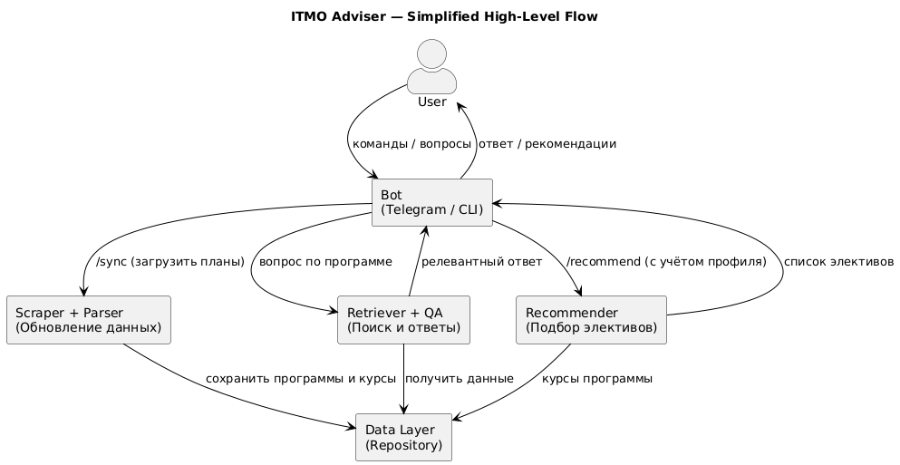

# 🦉 ITMO Adviser Owl

**ITMO Adviser** — это интерактивный чат-бот, который помогает абитуриенту выбрать между двумя магистерскими программами ИТМО:

- **Искусственный интеллект** (`ai`)
- **Управление ИИ-продуктами (AI Product)** (`ai_product`)

Бот умеет:
- Парсить официальные страницы программ и загружать учебные планы.
- Отвечать на вопросы по содержимому программ (FAQ, список курсов).
- Рекомендовать элективные дисциплины на основе бэкграунда абитуриента.
- Работать в **Telegram** или в консоли.

---

## Принцип работы

1. **Парсинг сайтов**  
   Модуль `scraper.py` скачивает страницы программ с сайта ИТМО, находит ссылку на учебный план и сохраняет HTML, FAQ и файл плана (PDF/DOCX).

2. **Парсинг учебных планов**  
   Модуль `curriculum_parser.py` извлекает список дисциплин из PDF/DOCX или HTML страницы, определяет семестры, тип курса (основной/электив) и теги (ML, NLP, Product, MLOps и т.д.).

3. **Хранилище данных**  
   Модуль `repository.py` сохраняет данные в SQLite (`programs`, `courses`). Все запросы к данным проходят через этот слой.

4. **Поиск по содержимому**  
   Модуль `retriever.py` строит TF-IDF векторное представление всех курсов и FAQ, чтобы быстро находить релевантные ответы на вопросы абитуриента.

5. **Фильтрация вопросов**  
   Модуль `guard.py` проверяет, что вопрос в домене магистерских программ (учеба, курсы, семестры, поступление).

6. **Ответы на вопросы**  
   Модуль `qa.py` принимает вопрос, ищет векторно-поиском релевантные куски текста и формирует ответ.

7. **Рекомендации элективов**  
   Модуль `recommender.py` подбирает элективные дисциплины по тегам, учитывая профиль пользователя (`junior_ml`, `product_manager`, `data_engineer` и т.д.).

8. **Диалог и состояние пользователя**  
   Модуль `dialog.py` хранит состояние пользователя (выбранная программа, бэкграунд) и управляет шагами общения.

9. **Интерфейсы**  
   - **Telegram:** `bot_telegram.py` — обработка команд (`/start`, `/sync`, `/recommend`) и сообщений.  
   - **CLI:** консольный режим в `app.py`.

---
### Основные потоки:


## 📂 Структура проекта
````
owl/
└── itmo_advisor/
├── app.py                # Точка входа, запуск бота или CLI
├── config.py             # Конфигурация и константы
├── domain.py             # Описание доменных сущностей (Program, Course)
├── repository.py         # Работа с базой данных SQLite
├── scraper.py            # Парсинг страниц ИТМО и скачивание планов
├── curriculum_parser.py  # Извлечение данных из планов (PDF/DOCX/HTML)
├── retriever.py          # TF-IDF поиск по курсам и FAQ
├── recommender.py        # Рекомендации элективов по бэкграунду
├── guard.py              # Проверка релевантности вопросов
├── dialog.py             # Логика диалога и состояния пользователя
├── bot_telegram.py       # Telegram-интерфейс
├── qa.py                 # Модуль ответов на вопросы
├── utils.py              # Утилиты и загрузка окружения
├── requirements.txt      # Зависимости проекта
└── .env.example          # Пример конфигурации окружения
````

---

## ⚙️ Установка и запуск

### 1. Клонирование проекта
```bash
git clone https://github.com/your-repo/owl.git
cd owl/itmo_advisor
```

### 2. Установка зависимостей
```bash
pip install -r requirements.txt
```

### 3. Настройка переменных окружения
Создайте .env на основе .env.example:
```bash
TELEGRAM_TOKEN=your_telegram_bot_token
DATA_DIR=./data
DB_PATH=./data/itmo_advisor.db
```

### 4. Первичная синхронизация данных
```bash
python app.py --sync
```
### 5. Запуск бота в Telegram
```bash
python app.py --bot
```
### 6. Запуск в консоли
```bash
python app.py --cli
```

### 💡 Пример диалога
```
/start
> ai
Ок, выбрана программа: Искусственный интеллект.
Расскажите про ваш бэкграунд...
> я джун ML
Отлично, учту ваш профиль. Спросите что-нибудь по обучению или введите /recommend.
> Какие курсы по NLP есть?
• Курс «Обработка естественного языка» — возможно релевантно вашему вопросу
...
```

